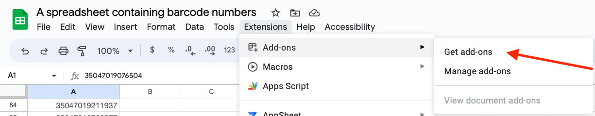
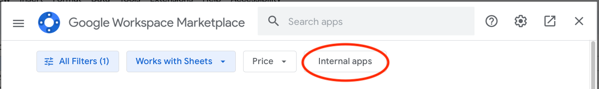
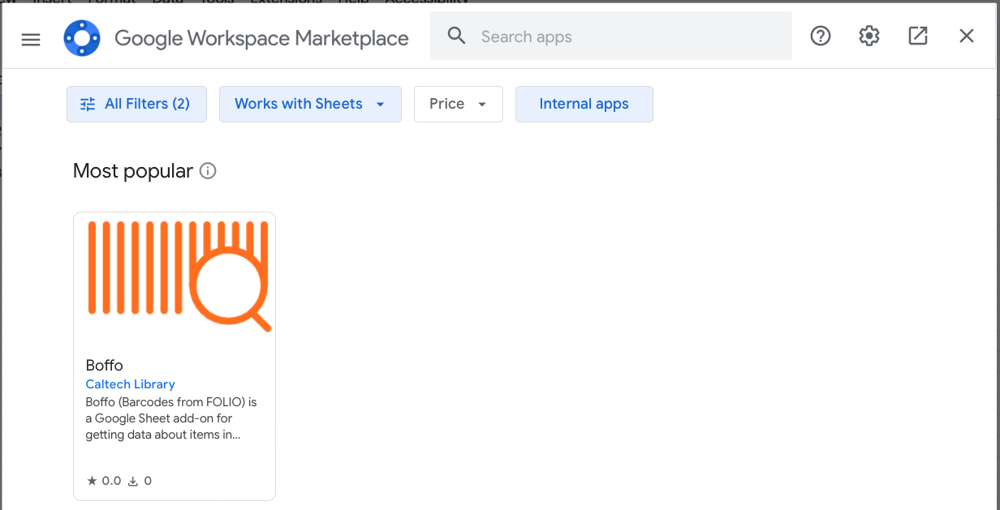
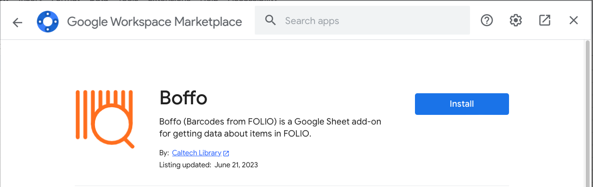
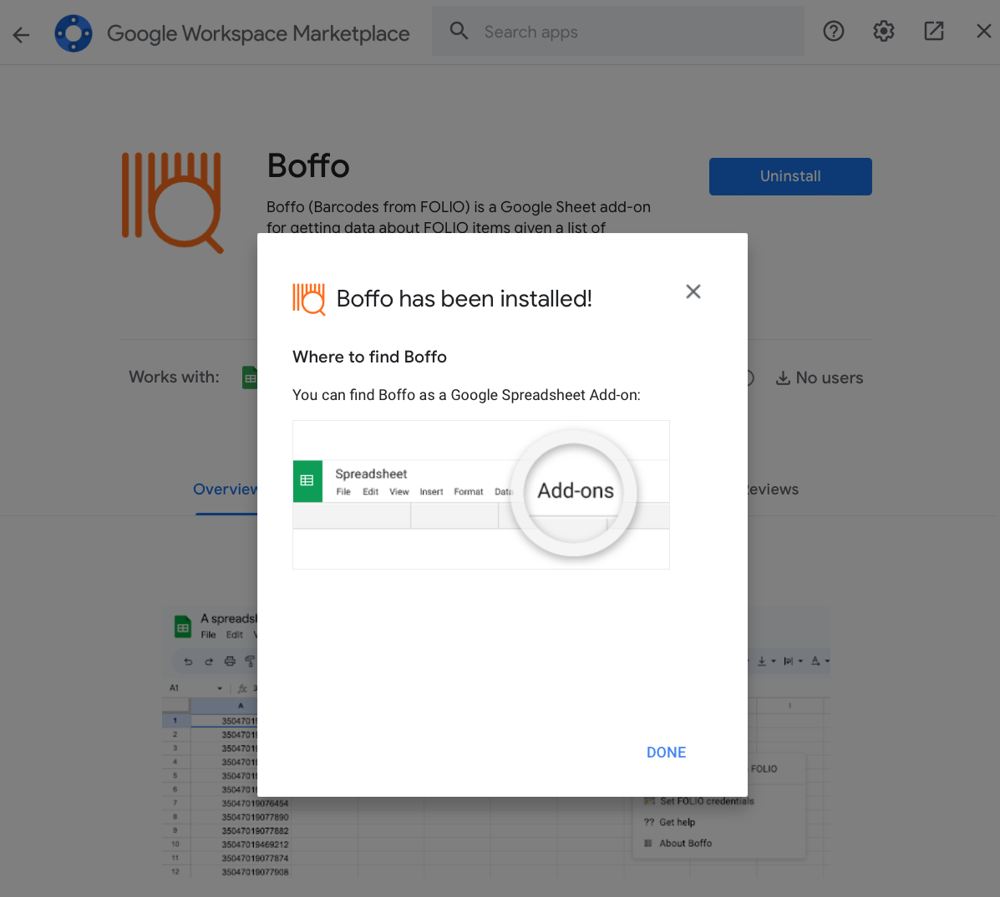

# Boffo

Boffo (_**B**arc**o**des **f**rom **FO**LIO_) is a Google Sheet script for getting data about FOLIO items given a list of barcodes.

## Table of contents

* [Introduction](#introduction)
* [Installation](#installation)
* [Quick start](#quick-start)
* [Usage](#usage)
* [Known issues and limitations](#known-issues-and-limitations)
* [Getting help](#getting-help)
* [Contributing](#contributing)
* [License](#license)
* [Acknowledgments](#authors-and-acknowledgments)

## Introduction

Boffo (_**B**arc**o**des **f**rom **FO**LIO_) is an add-on for [Google Sheets](https://www.google.com/sheets/about/) written by the [Caltech Library](https://library.caltech.edu/library/home). It lets you select item barcodes in a spreadsheet and retrieve information about the [item records](https://caltechlibrary.github.io/boffo/glossary) from a [FOLIO](https://folio.org) server.

## Installation

For Caltech Library staff, Boffo is available from the Google Marketplace for add-ons. To install it, look for the _Extensions_ menu at the top of your Google sheet, click on it, then click on the item _Get add-ons_ from the _Add-ons_ submenu:

In the Google Workspace Marketplace panel that is shown next, click on the button titled _Internal apps_ near the top:

This will change the panel to show apps available for the Caltech Library staff. Boffo should be visible there. Click on the item for Boffo,

which will make the Google panel show more details about Boffo and a blue _Install_ button:

Click on the _Install_ button. Google will show you several dialogs asking for your permission to install Boffo. Accept and allow the installation, then close the Google Marketplace panel.

## Quick start

## Usage

When you first use it in a Google sheet, Boffo will initially request your FOLIO account login and password, but it only uses that information to ask FOLIO for an API token. Boffo never stores your FOLIO login or password, nor does it need any other personal information to do its work.

## Known issues and limitations

Immediately after you install Boffo as an add-on in a Google Sheet, Google will show you a pop-up titled "Boffo has been installed!" that looks like this:

This pop-up is incorrect: it states that Boffo has been installed under a menu titled _Add-ons_, but in fact, Google installs it in a menu titled _Extensions_. Please ignore the instructions to look for an _Add-ons_ menu. This pop-up is automatically generated by Google's system and not under the control of Boffo, and we can't make changes to it.

## Getting help

If you find an issue, please submit it in [the GitHub issue tracker](https://github.com/caltechlibrary/boffo/issues) for this repository.

## Contributing

Your help and participation in enhancing Boffo is welcome!  Please visit the [guidelines for contributing](CONTRIBUTING.md) for some tips on getting started.

## License

Software produced by the Caltech Library is Copyright © 2023 California Institute of Technology.  This software is freely distributed under a BSD-style license.  Please see the [LICENSE](LICENSE) file for more information.

## Acknowledgments

The [vector artwork](https://thenounproject.com/icon/barcode-5653940/) used as a starting point for the logo for this project was created by [Sunarto Hamizan](https://thenounproject.com/sunarto_hamizan/)  It is licensed under the Creative Commons [Attribution 3.0 Unported](https://creativecommons.org/licenses/by/3.0/deed.en) license.  The vector graphics was modified by Mike Hucka to change the color.

This work was funded by the California Institute of Technology Library.

   
  

