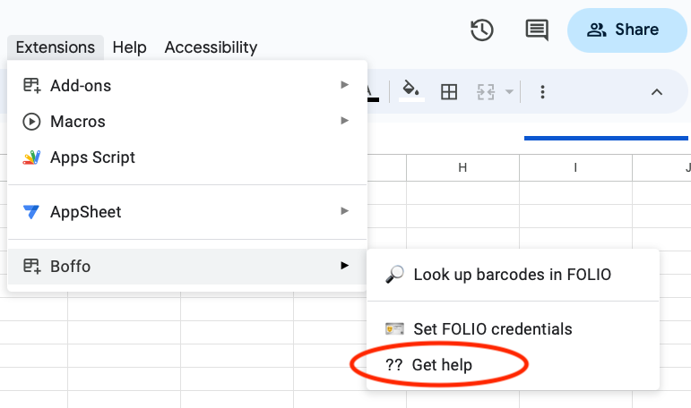
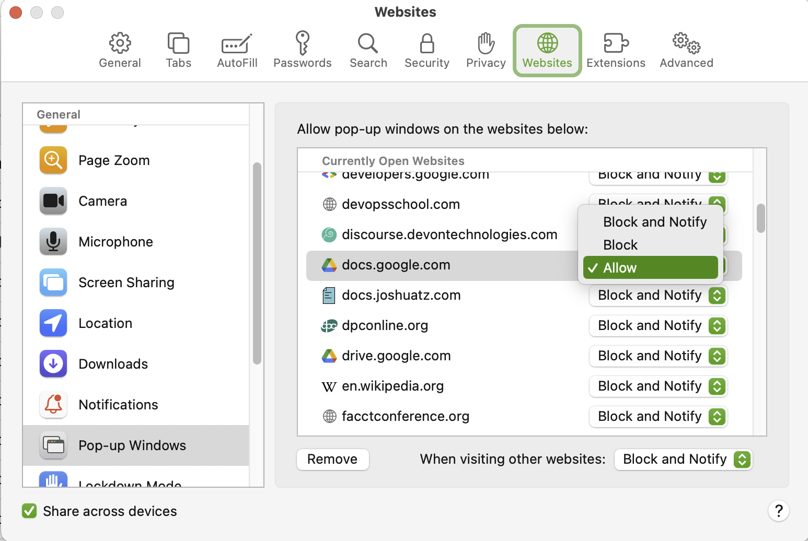

# Boffo

Boffo (_**B**arc**o**des **f**rom **FO**LIO_) is a Google Sheet script for getting data about FOLIO items given a list of barcodes.

## Table of contents

* [Introduction](#introduction)
* [Installation](#installation)
* [Quick start](#quick-start)
* [Usage](#usage)
* [Known issues and limitations](#known-issues-and-limitations)
* [Getting help](#getting-help)
* [Contributing](#contributing)
* [License](#license)
* [Acknowledgments](#authors-and-acknowledgments)

## Introduction

## Installation

## Quick start

## Usage

## Known issues and limitations

The Boffo menu includes a "Get Help" item.

This opens a link to the Boffo help pages, but browser pop-up or content blockers or other browser security settings can prevent Boffo from being able to open the help pages directly. In that case, it has to resort to showing a dialog and asking the user to click on a link in the dialog in order to open a separate window on the help pages. To avoid this annoyance, you may wish to allow pop-ups on the domain docs.google.com. On Safari, you can do this as follows:
1. Open Safari's Settings
2. Click on _Websites_ in the top list of panels
3. Find and click on "Pop-up Windows" in the left-hand list
4. Look for docs.google.com in the list on the right-hand side
5. Click on the pop-up menu and select _Allow_ from the list

## Getting help

If you find an issue, please submit it in [the GitHub issue tracker](https://github.com/caltechlibrary/boffo/issues) for this repository.

## Contributing

Your help and participation in enhancing Boffo is welcome!  Please visit the [guidelines for contributing](CONTRIBUTING.md) for some tips on getting started.

## License

Software produced by the Caltech Library is Copyright © 2023 California Institute of Technology.  This software is freely distributed under a BSD-style license.  Please see the [LICENSE](LICENSE) file for more information.

## Acknowledgments

This work was funded by the California Institute of Technology Library.

   
  

