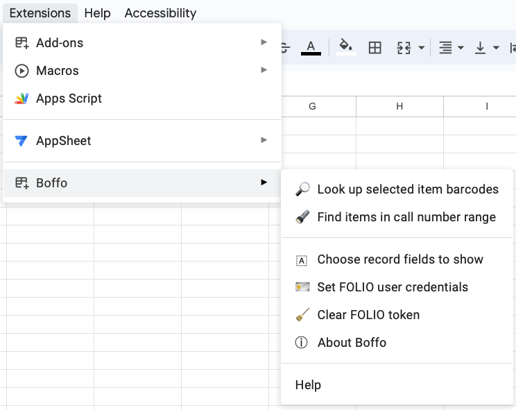

# Boffo

Boffo (_**B**arc**o**des **f**rom **FO**LIO_) is a Google Sheet script for getting data about FOLIO items given a list of barcodes.

## Table of contents

* [Introduction](#introduction)
* [Installation](#installation)
* [Quick start](#quick-start)
* [Usage](#usage)
* [Known issues and limitations](#known-issues-and-limitations)
* [Getting help](#getting-help)
* [Contributing](#contributing)
* [License](#license)
* [Acknowledgments](#authors-and-acknowledgments)

## Introduction

Boffo (a loose acronym of _**B**arc**o**des **f**rom **FO**LIO_, and pronounced like [the noun](https://en.wiktionary.org/wiki/boffo)) is an add-on for [Google Sheets](https://www.google.com/sheets/about/). It lets you select item barcodes in a spreadsheet and retrieve information about the [item records](https://caltechlibrary.github.io/boffo/glossary) from a [FOLIO](https://folio.org) server.

## Installation

If you're Caltech Library staff, Boffo is available to you from the Google Marketplace for add-ons as an "Internal" add-on; if you're not Caltech Library staff, you can still install Boffo using alternate methods, as described in the pages linked below:

* [Installation instructions for Caltech Library staff](https://caltechlibrary.github.io/boffo/installation.html#using-google-marketplace)
* [Installation instructions for others](https://caltechlibrary.github.io/boffo/installation.html#directly-from-source)

## Quick start

Once installed as an Add-on on a Google Sheet, Boffo will present itself as a menu item in the _Extensions_ menu across the top of the sheet. Selecting the _Boffo_ item in the _Extensions_ menu will present several items in a submenu:

Boffo's main function is _Look up barcodes in FOLIO_ and its use is very simple:
1. Select some item barcodes in your Google spreadsheet
2. Pull down the _Extensions_ menu
3. Select _Look up barcodes in FOLIO_ from the Boffo menu

Boffo will create a new sheet titled "Item Data" in the spreadsheet where you ran it, then add the results of the item lookups to the new sheet.

If this is the first time you've used Boffo, it will first request your FOLIO account login and password in order to ask FOLIO for a token to use the network services. Boffo will store that token (and _not_ your login or password), then proceed to look up the items whose barcodes are highlighted in the sheet. On subsequent invocations, Boffo will not ask you for FOLIO credentials unless something happens to make the token invalid (in which case, Boffo will ask you for the credentials again and generate a new token).

## Usage

Please see the detailed [usage section in the Boffo documentation](https://caltechlibrary.github.io/boffo/usage.html) for more information about Boffo's features and how to use them.

## Known issues and limitations

Depending on your account type, Boffo will run into Google quotas limiting maximum execution time. For G Suite users such as the Caltech Library, this limit is 30 minutes. For non-G Suite users, the limit is 6 minutes. At the time of this writing, Boffo can retrieve item records at a rate of about 70--100/second, so the time limit will limit non-G suite users to looking up somewhere between 25,000--35,000 item records at a time.

## Getting help

If you find an issue, please submit it in [the GitHub issue tracker](https://github.com/caltechlibrary/boffo/issues) for this repository.

## Contributing

Your help and participation in enhancing Boffo is welcome!  Please visit the [guidelines for contributing](CONTRIBUTING.md) for some tips on getting started.

## License

Software produced by the Caltech Library is Copyright © 2023 California Institute of Technology.  This software is freely distributed under a BSD-style license.  Please see the [LICENSE](LICENSE) file for more information.

## Acknowledgments

The [vector artwork](https://thenounproject.com/icon/barcode-5653940/) used as a starting point for the logo for this project was created by [Sunarto Hamizan](https://thenounproject.com/sunarto_hamizan/)  It is licensed under the Creative Commons [Attribution 3.0 Unported](https://creativecommons.org/licenses/by/3.0/deed.en) license.  The vector graphics was modified by Mike Hucka to change the color.

This work was funded by the California Institute of Technology Library.

   
  

