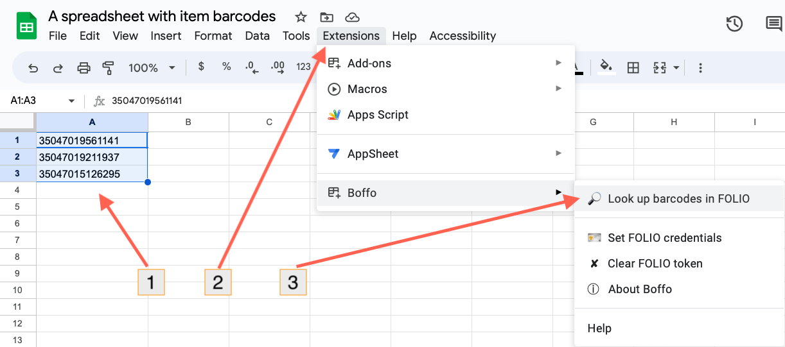

# Boffo

Boffo (_**B**arc**o**des **f**rom **FO**LIO_) is a Google Sheet script for getting data about FOLIO items given a list of barcodes.

<figure>

<figcaption>Once installed, Boffo lets you select some barcodes in your spreadsheet and look them up in FOLIO.
</figcaption>
</figure>

## Sections

```{toctree}
---
maxdepth: 2
---
introduction.md
installation.md
usage.md
glossary.md
colophon.md
```
