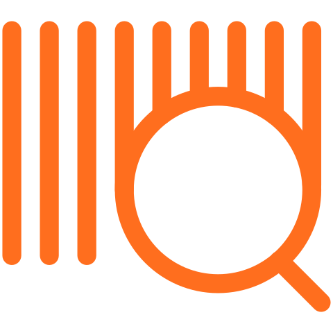

# Boffo

Boffo (a loose acronym of _**B**arc**o**des **f**rom **FO**LIO_, and pronounced like [the noun](https://en.wiktionary.org/wiki/boffo)) is an add-on for Google Sheets written by the Caltech Library. It lets you select item barcodes in a spreadsheet and retrieve information about the item records from a FOLIO server. Boffo creates a new sheet titled "Item Data" in the spreadsheet where you ran it, and adds the results of the item lookups to the new sheet.

<figure>

<figcaption>Select some barcodes in your spreadsheet and select the <em>Look up barcodes in FOLIO</em> menu item.
</figcaption>
</figure>

<figure>
<p align="center">
<span style="font-size: 50pt">&darr;</span>
</p>
</figure>

<figure>

<figcaption>Boffo creates a new sheet in the same spreadsheet with the results of the lookup.</figcaption>
</figure>


## Sections

```{toctree}
---
maxdepth: 2
---
installation.md
usage.md
known-issues.md
glossary.md
colophon.md
```
