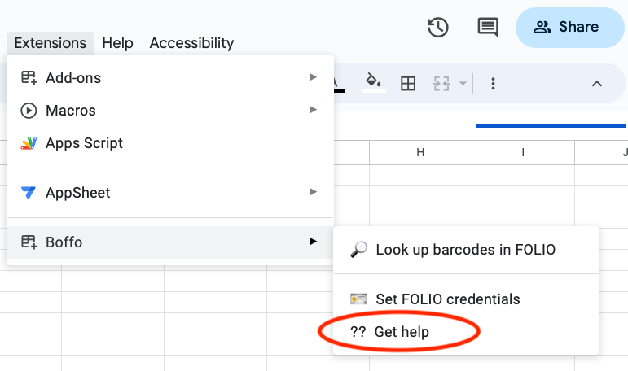

# Installation

## Disable pop-up blocking for docs.google.com

Most browsers these days block pop-up windows by default. Unfortunately, this interferes with the operation of Boffo's help menu item:

This menu option tries to open a link to the Boffo help pages, but browser pop-up or content blockers or other browser security settings can prevent Boffo from being able to open the help pages directly. When that happens, Boffo has to resort to showing a dialog and asking the user to click on a link in the dialog in order to open a separate window on the help pages. To avoid this annoyance, you may wish to allow pop-ups on the domain docs.google.com. 

### If you use Safari

1. Open Safari's Settings
2. Click on _Websites_ in the top list of panels
3. Find and click on "Pop-up Windows" in the left-hand list
4. Look for docs.google.com in the list on the right-hand side
5. Click on the pop-up menu and select _Allow_ from the list

### If you use Chrome
