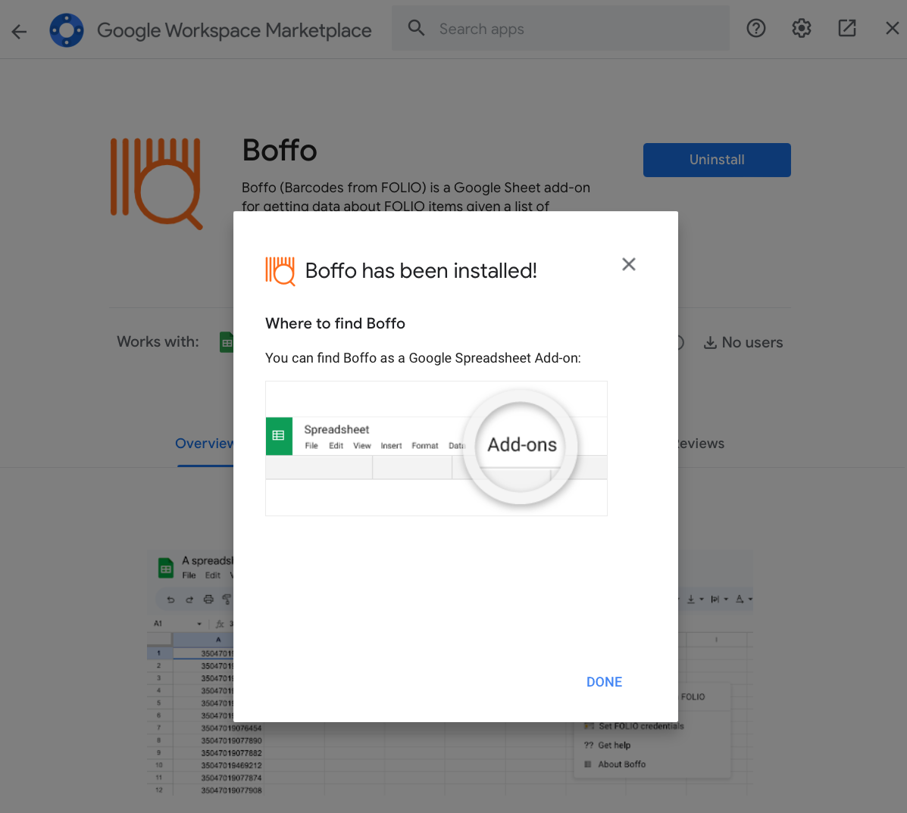

# Installation

For Caltech Library staff, Boffo is available from the Google Marketplace for add-ons.

## Using Google Marketplace

To install Boffo, look for the _Extensions_ menu at the top of your Google sheet, click on it, then click on the item _Get add-ons_ from the _Add-ons_ submenu:

In the Google Workspace Marketplace panel that is shown next, click on the button titled _Internal apps_ near the top:

This will change the panel to show apps available for the Caltech Library staff. Boffo should be visible there. Click on the item for Boffo,

which will make the Google panel show more details about Boffo and a blue _Install_ button:

Click on the _Install_ button. Google will show you several dialogs asking for your permission to install Boffo. Accept and allow the installation, then close the Google Marketplace panel.

### Incorrect post-installation notification panel

Note that after you install Boffo as an add-on in a Google Sheet, Google will show you a pop-up titled "Boffo has been installed!" that looks like this:

This pop-up states that Boffo has been installed under a menu titled _Add-ons_, but **this is incorrect**. In fact, Google installs it in a menu titled _Extensions_. Please **ignore the instructions to look for an _Add-ons_ menu**. This pop-up is automatically generated by Google's system and not under the control of Boffo, and we can't make changes to it.
