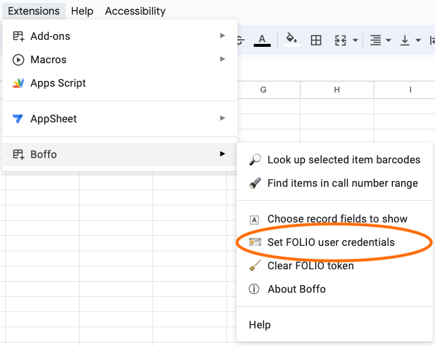
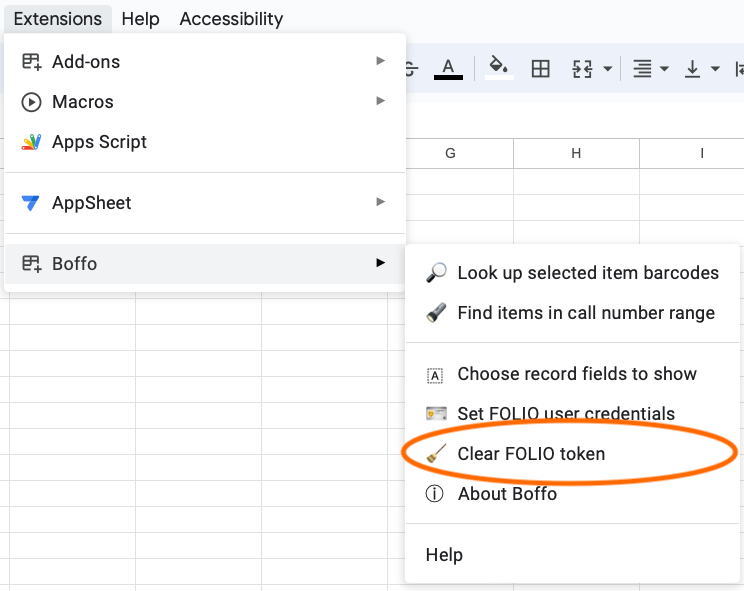

# Usage

Once installed as an Add-on on a Google Sheet, Boffo will present itself as a menu item in the _Extensions_ menu across the top of the sheet. Selecting the _Boffo_ item in the _Extensions_ menu will present several items in a submenu:

<figure>

<figcaption>Boffo's menu can be found in the <em>Extensions</em> menu item in Google Sheets.
</figcaption>
</figure>

## Look up barcodes

Boffo's main function is _Look up barcodes in FOLIO_ and its use is very simple:
1. Select some item barcodes in your Google spreadsheet
2. Pull down the _Extensions_ menu
3. Select _Look up barcodes in FOLIO_ from the Boffo menu

<figure>

<figcaption>Select some barcodes in your spreadsheet and select the <em>Look up barcodes in FOLIO</em> menu item.
</figcaption>
</figure>

If this is the first time you've used Boffo, it will first request your FOLIO account login and password in order to ask FOLIO for a token to use the network services. Boffo will store that token (and _not_ your login or password), then proceed to look up the items whose barcodes are highlighted in the sheet. When it's done, Boffo will show you the results in a new sheet in the same spreadsheet.

On subsequent invocations, Boffo will not ask you for FOLIO credentials unless something happens to make the token invalid (in which case, Boffo will ask you for the credentials again and generate a new token).

## Reset FOLIO credentials

If you ever want to change the login that you use to access FOLIO services with Boffo, you can do so by selecting the _Set FOLIO credentials_ item from Boffo's menu:

<figure>

</figure>

This will make Boffo bring up the same FOLIO inforrmation and account details form that it used to ask you for your login and password the first time:

<figure>

<figcaption>The form to reset your FOLIO credentials. (Note: this screenshot shows blank values for all the fields, but for Caltech Library staff who install Boffo as an internal add-on from the Google Marketplace, the values of the FOLIO URL and tenant id will be prefilled with the correct values and you will only need to enter the user name and password.)
</figcaption>
</figure>

## Clear FOLIO token

If you'd like to reset your FOLIO API token deliberately, you can do so by selecting the menu item _Clear FOLIO token_:

<figure>

<figcaption>The menu item to unset/clear your current FOLIO token.
</figcaption>
</figure>

This wil remove the stored token, and the next time you use the _Look up barcodes in FOLIO_ menu item (or you use the _Set FOLIO credentials_ menu item), Boffo will ask you for your credentials again and then regenerate a new token.

## Get info about Boffo

The _About Boffo_ menu item can be used to find out more about Boffo:

<figure>

</figure>

Perhaps the most useful part of the information dialog that is shown by the _About Boffo_ command is Boff's version number on the second line:

<figure>

<figcaption>The information box shown by the <em>About Boffo</em> menu item.
</figcaption>
</figure>

## Get help and report issues

The last item in the Boffo menu is _Help_. The contents are automatically generated by Google's Add-ons framework.  Included in this information dialog is a link that lets you report issues.

<figure>

</figure>
